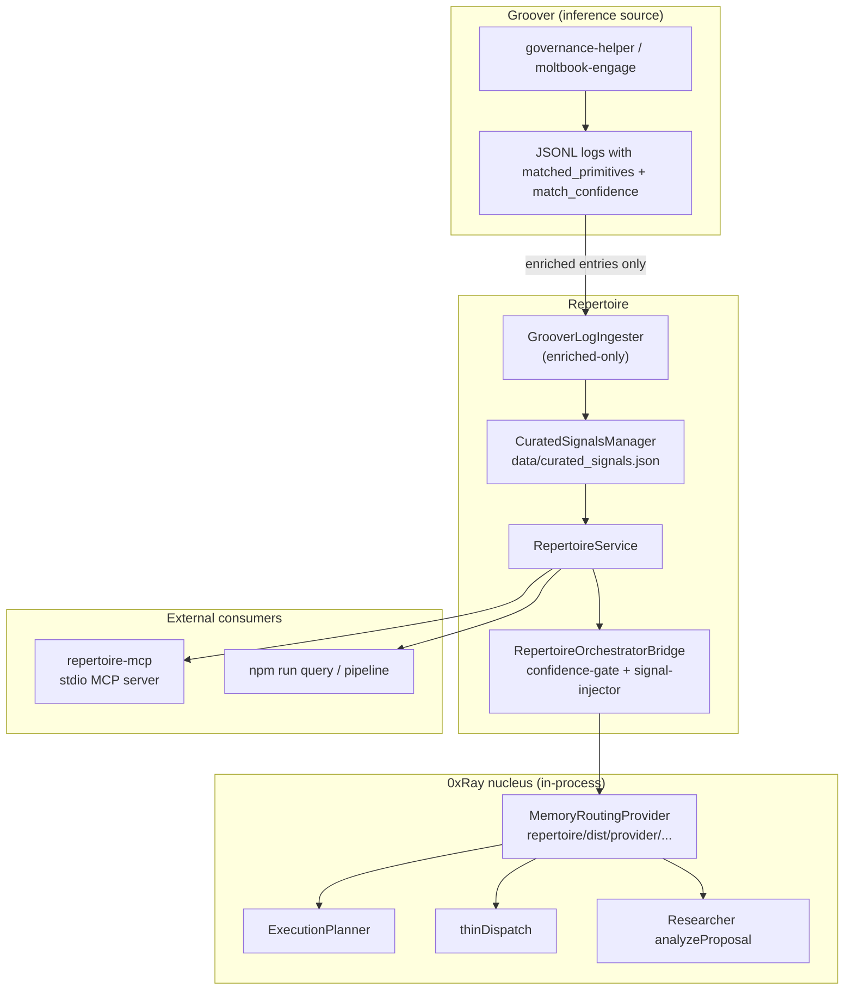

# Repertoire Architecture

Repertoire is the deep-memory and primitive-registry layer for the 0xRay / Groover stack. It ingests enriched inference logs, maintains `curated_signals.json`, and exposes confidence-aware routing to 0xRay through an in-process provider contract and an external MCP surface.

**Status:** Operational in strict, high-signal mode. The internal loop (ingest → registry → `MemoryRoutingProvider` → researcher) is implemented and covered by the E2E harness (`npm run test:e2e`).

---

## 1. High-Level System



**North-star outcome:** 0xRay routes with memory. Task descriptions that match validated primitives influence complexity scoring, agent selection, and governance evidence — without simulated fallbacks.

---

## 2. Core Data Model

| Artifact | Location | Role |
|----------|----------|------|
| Primitive registry | `data/curated_signals.json` | Canonical signal definitions, tags, `observation_stats` |
| Inference state | `data/inference-state.json` | Processed comment/session IDs for idempotent ingest |
| Groover logs (canonical) | `logs/groover-inference/*.jsonl` | Normalized enriched entries after ingest |
| Meta-inference | `logs/meta-inference/synthesis.md` | Optional synthesis excerpt injected into task metadata |
| Pipeline report | `logs/pipeline-run.json` | Ingest + synthesis run summary |

Each **curated signal** carries:

- `name`, `definition`, `tags`, `priority`, `status` (`proposed` → `validated`)
- `observation_stats` (populated only from enriched observations):
  - `observation_count`
  - `avg_confidence`
  - `max_confidence`
  - `governance_forced_count`
  - `last_seen`

Confidence values always originate from `observation_stats` or explicit task metadata (`memorySignalConfidences`). There are no text-score conversions or `0.5` fallbacks.

---

## 3. Enriched-Only Ingestion Policy

Repertoire operates in **strict enriched-only mode**. Unstructured Groover logs are skipped at ingest time.

### Required fields per log entry

A Groover JSONL line is accepted only when `isEnrichedGrooverLog()` passes:

1. `matched_primitives` — non-empty array of primitive names
2. `match_confidence` — object with a numeric confidence for **every** listed primitive

```typescript
// src/ingestion/groover-log-parser.ts
isEnrichedGrooverLog(raw) =>
  matched_primitives.length > 0 &&
  every primitive has match_confidence[name]: number
```

Entries missing these fields throw `EnrichedGrooverLogError` internally and increment `skipped` in the ingest result. Pre-`abeafbb` Groover logs (inference text only, no primitive metadata) are intentionally rejected.

### Ingest pipeline

```
Groover source JSONL
  → parse + validate (enriched-only)
  → append to logs/groover-inference/
  → recordPrimitiveObservations() per match (confidence ≥ gate)
  → promoteQualifiedSignals() (optional, default on)
```

**Trade-off (intentional):** Historical unstructured logs do not backfill the registry. Signal integrity is prioritized over coverage while the production path is proven.

---

## 4. Confidence Gate & Promotion

### Shared threshold: 0.55

`DEFAULT_PROMOTION_MIN_CONFIDENCE` and `DEFAULT_MIN_CONFIDENCE_GATE` are both **0.55**, defined in `CuratedSignalsManager` and re-exported from `confidence-gate.ts`.

| Stage | Rule |
|-------|------|
| Observation recording | `match.confidence >= 0.55` required to update `observation_stats` |
| Promotion | `avg_confidence >= 0.55` **and** `observation_count >= 2` |
| Task confidence | Only signals at or above 0.55 enter `TaskConfidenceContext.signals` |
| MCP query filters | `getHighConfidenceSignals` / `searchPrimitives` default to 0.55 |

### Promotion gate

`shouldPromoteSignal()` promotes `proposed` → `validated` when:

- `observation_stats.avg_confidence >= 0.55`
- `observation_stats.observation_count >= 2`

Promotion runs automatically after ingest when `promoteAfterIngest: true` (default).

### Trap detection & complexity boost

`getConfidenceForTask()` in `confidence-gate.ts`:

1. Matches task text against the registry (`matchByText`, min score 2)
2. Detects ontological-trap context via:
   - `TYPE: ontological-trap` in text
   - `task.metadata.ontologicalTrapDetected`
   - Matched signal tags containing `ontological-trap`
3. Sets `highConfidenceTrapPresent` when trap is detected **and** at least one trap signal has confidence ≥ 0.55
4. Computes `complexityBoost`:
   - `+ round(10 + maxConfidence × 10)` when high-confidence trap present
   - `+ 5` when two or more high-confidence signals match
5. Sets `recommendedAgent: 'architect'` when `highConfidenceTrapPresent`

Trap-capable agents (`TRAP_CAPABLE_AGENTS`): `architect`, `security-auditor`, `researcher`.

---

## 5. Deployment Reality: Who Calls What

Most production usage is **not** a self-contained 0xRay monolith. Hermes, OpenCode, Claude Code, and similar hosts run an external LLM that invokes tools over MCP. The LLM never loads `MemoryRoutingProvider` directly — it calls named tools.

```
┌─────────────────────────────────────────────────────────────┐
│  Hermes / OpenCode / Claude Code (host)                     │
│    LLM decides which tools to call                          │
│         │                    │                              │
│         ▼                    ▼                              │
│  repertoire-mcp          xray-researcher MCP                │
│  (repertoire__*)         (analyze_proposal, search_*)       │
└─────────────────────────────────────────────────────────────┘

┌─────────────────────────────────────────────────────────────┐
│  0xRay orchestrator process (same Node event loop)         │
│    ExecutionPlanner / thinDispatch / TaskHandler          │
│         │                                                   │
│         ▼                                                   │
│    MemoryRoutingProvider (in-process, no stdio)             │
└─────────────────────────────────────────────────────────────┘
```

### Integration decision matrix

| Consumer | Repertoire | 0xRay agents | Why |
|----------|------------|--------------|-----|
| **Hermes / OpenCode LLM** | MCP `repertoire__*` | MCP `xray-researcher`, `xray-orchestrator`, etc. | Only surface the host exposes to the model |
| **ExecutionPlanner / thinDispatch** | In-process `MemoryRoutingProvider` | N/A (deterministic routing, not LLM) | Same process, no IPC overhead |
| **0xRay governance (in-process mode)** | In-process provider inside skill instance | `callInProcessSkill` | Serverless / Vercel path |
| **0xRay governance (MCP mode)** | Repertoire MCP **or** provider in subprocess | `mcpClientManager.callServerTool` | Default non-serverless path |
| **Third-party / future agents** | MCP `repertoire__*` | Their own MCP clients | Standard portable contract |

**Canonical rule:** MCP is the **primary, documented contract** for any LLM-facing agent. In-process `MemoryRoutingProvider` is an **optimization for 0xRay routing code** that shares the orchestrator process — not a substitute for MCP when the LLM is the caller.

### Known gap (MCP subprocess researcher)

When `xray-researcher` runs as a **separate MCP process** (`npx 0xray mcp researcher`), the internal Repertoire wiring in `analyze_proposal` only works if that subprocess successfully loads `MemoryRoutingProvider` (requires `memory_routing.enabled` in `features.json` and a resolvable repertoire path). `initializeMemoryRouting()` is not currently called from `researcher.server.ts` on startup, so trap wiring may silently no-op in pure MCP mode.

**Mitigations (pick one or combine):**

1. **LLM-driven (recommended for Hermes):** Instruct the agent to call `repertoire__get_task_confidence` before `analyze_proposal` on trap-classified tasks. This works regardless of process boundaries.
2. **Server-side:** Initialize memory routing in the researcher MCP server constructor and/or add an MCP-client fallback to `repertoire-mcp` when the in-process provider is null.
3. **Live validation:** Test trap flows through MCP tooling, not only the in-process E2E harness.

---

## 6. Internal vs External Surfaces

Repertoire exposes two complementary surfaces. They share `RepertoireService` logic but serve different consumers.

### Internal: `MemoryRoutingProvider` (0xRay orchestrator process)

**Module:** `dist/provider/memory-routing-provider.js`  
**Factory:** `createMemoryRoutingProvider(config?)`  
**Loaded by:** 0xRay `provider-loader.ts` when `features.json` has `memory_routing.enabled: true`

| Method | Used by |
|--------|---------|
| `buildRoutingContext(operation)` | thinDispatch, researcher (when co-located) |
| `enhanceAgentCapabilities(map)` | AgentCapabilitiesManager |
| `enrichTasks(tasks)` | ExecutionPlanner |
| `buildInheritedContext(tasks)` | AsideContext / plan metadata |
| `selectAgent(...)` | ExecutionPlanner agent assignment |
| `resolveThinDispatch(...)` | thinDispatch.scoreAndRoute |
| `getTaskConfidence(task)` | ExecutionPlanner complexity; researcher (in-process / co-located subprocess) |
| `ingestFeedback(entry)` | TaskHandler feedback loop |

**When to use:** Orchestrator routing code running in the same Node process as `ExecutionPlanner` or `thinDispatch`. Not the default path for Hermes-hosted LLM sessions.

**Configuration** (in 0xRay `features.json`):

```json
"memory_routing": {
  "enabled": true,
  "provider": "repertoire",
  "module_path": "../repertoire/dist/provider/memory-routing-provider.js",
  "config": {
    "signalsPath": "../repertoire/data/curated_signals.json",
    "logDir": "../repertoire/logs/groover-inference"
  }
}
```

See also: [docs/MEMORY-ROUTING-PROVIDER.md](docs/MEMORY-ROUTING-PROVIDER.md).

### External: MCP server

**Binary:** `repertoire-mcp` (`dist/mcp/server.js`)  
**Transport:** stdio MCP  
**Consumers:** Grok agents, external MCP clients, manual inspection

| Tool | Purpose |
|------|---------|
| `repertoire__get_high_confidence_signals` | List signals above threshold, optional tag filter |
| `repertoire__get_task_confidence` | Full `TaskConfidenceContext` for a task description |
| `repertoire__search_primitives` | Text search against registry (`observation_stats` only) |
| `repertoire__ingest_feedback` | Record orchestrator outcome for feedback loop |

MCP tools mirror the in-process API and are the **supported interface for external LLM hosts**. The researcher's internal wiring calls `getMemoryRoutingProviderSync().getTaskConfidence()` when co-located; Hermes/OpenCode agents should call `repertoire__get_task_confidence` directly.

### CLI / scripts

| Command | Role |
|---------|------|
| `npm run ingest` | Ingest Groover logs from a source directory |
| `npm run pipeline` | Ingest + meta-inference pipeline |
| `npm run query` | Ad-hoc signal / confidence queries |
| `npm run test:e2e` | Fixture-driven regression for the enriched loop |

---

## 7. 0xRay Integration Points

When memory routing is enabled, Repertoire influences three routing surfaces:

### A. ExecutionPlanner

- `enrichTasks()` attaches `memorySignals`, `memorySignalConfidences`, `memoryComplexityBoost` to task metadata
- `calculateTaskComplexity()` adds `getTaskConfidence().complexityBoost`
- `selectAgent()` consults signal-aware scoring; trap tasks bias toward trap-capable agents

### B. thinDispatch

- `resolveThinDispatch()` may override the tier-default agent to `architect` when `highConfidenceTrapPresent` and adjusted score ≥ 26
- `provenance-failure` tag can route to `bug-triage-specialist` at lower scores

### C. Researcher (`analyze_proposal`)

**Module (0xRay):** `src/mcps/researcher-confidence.ts`  
**Entry:** `XrayLibrarianServer.analyzeProposal()`

```
analyze_proposal(title, description, type)
  │
  ├─ Trigger?
  │    • ontological-trap language in description/type
  │    OR high-confidence primitive match (buildRoutingContext)
  │
  ├─ getTaskConfidence() via MemoryRoutingProvider
  │
  ├─ highConfidenceTrapPresent?
  │    • inject Repertoire evidence into LLM governance prompt
  │    • append MEMORY_ROUTING block to response
  │
  └─ tryLLMGovernance("researcher", enriched evidence)
```

**MEMORY_ROUTING block** (appended to governance output when trap is high-confidence):

```
MEMORY_ROUTING:
  provider: repertoire
  trigger: trap-language | high-confidence-primitives
  matchedSignals: attestation-as-map
  highConfidenceTrapPresent: true
  complexityBoost: 19
  recommendedAgent: architect
```

This makes the Repertoire signal visible and auditable in governance output without requiring MCP.

---

## 8. End-to-End Flow (Production Path)

```
1. Groover emits enriched log
     matched_primitives: ["attestation-as-map"]
     match_confidence:   { "attestation-as-map": 0.92 }
     governance_forced:  true

2. Repertoire ingest
     → observation_stats updated (avg_confidence, count)
     → signal promoted to validated (≥2 obs, ≥0.55 avg)

3. Task arrives in 0xRay
     description contains trap language or matches promoted primitive

4. MemoryRoutingProvider.getTaskConfidence()
     → highConfidenceTrapPresent: true
     → complexityBoost: N
     → recommendedAgent: architect

5. Downstream effects
     • ExecutionPlanner raises task complexity
     • thinDispatch / selectAgent prefer architect
     • Researcher injects evidence + MEMORY_ROUTING block
```

The E2E harness (`scripts/e2e-confidence-loop.test.ts`) validates steps 2–4 with fixtures. Live validation with the first post-`abeafbb` Groover log is the remaining operational checkpoint.

---

### Hermes / OpenCode flow (MCP-primary)

```
LLM receives trap-classified task
  → repertoire__get_task_confidence({ description })
  → highConfidenceTrapPresent?
       → repertoire__search_primitives (optional detail)
       → xray-researcher analyze_proposal (with confidence in evidence)
       → route to architect per recommendedAgent
```

This path does not depend on `MemoryRoutingProvider` being loaded in the LLM host process.

---

## 9. Key Source Files

| Area | Path |
|------|------|
| Service facade | `src/RepertoireService.ts` |
| Groover parser (enriched gate) | `src/ingestion/groover-log-parser.ts` |
| Groover ingester | `src/ingestion/groover-log-ingester.ts` |
| Signal registry | `src/registry/CuratedSignalsManager.ts` |
| Confidence gate | `src/orchestrator-bridge/confidence-gate.ts` |
| Signal injection / scoring | `src/orchestrator-bridge/signal-injector.ts` |
| Orchestrator bridge | `src/orchestrator-bridge/RepertoireOrchestratorBridge.ts` |
| Memory routing provider | `src/provider/memory-routing-provider.ts` |
| MCP server | `src/mcp/server.ts` |
| E2E regression | `scripts/e2e-confidence-loop.test.ts` |

**0xRay (cross-repo):**

| Area | Path |
|------|------|
| Provider loader | `xray/src/memory-routing/provider-loader.ts` |
| Researcher wiring | `xray/src/mcps/researcher-confidence.ts` |
| Researcher entry | `xray/src/mcps/researcher.server.ts` |

---

## 10. Testing & Verification

| Suite | Command | Coverage |
|-------|---------|----------|
| Unit tests | `npm test` | Parser, confidence gate, registry, MCP query helpers |
| E2E harness | `npm run test:e2e` | Full enriched loop + unstructured skip |
| 0xRay integration | `xray` memory-routing + researcher tests | Provider enrichment, complexity boost, MEMORY_ROUTING |

**E2E harness asserts:**

- Enriched logs import and promote signals
- `getTaskConfidence` detects traps with complexity boost
- `searchPrimitives` returns observation-backed matches only
- `selectAgent` / `resolveThinDispatch` route trap tasks to `architect`
- Unstructured logs are skipped (`imported: 0`, `skipped: 1`)

---

## 11. Current Boundaries

### In scope (implemented)

- Enriched-only Groover ingest
- Strict confidence (no legacy fallbacks)
- Promotion gate (0.55 / 2 observations)
- In-process `MemoryRoutingProvider` for 0xRay nucleus
- MCP external query surface
- Researcher trap wiring with MEMORY_ROUTING block
- Orchestrator feedback ingest (`repertoire__ingest_feedback` / `ingestFeedback`)

### Explicitly deferred

| Item | Rationale |
|------|-----------|
| MCP-primary validation | Live trap test via `repertoire__get_task_confidence` + `xray-researcher`, not in-process harness alone |
| Researcher subprocess init | `initializeMemoryRouting()` not yet called in `researcher.server.ts`; internal wiring may no-op in MCP mode |
| MCP fallback inside researcher | Deferred; LLM-driven MCP calls are the near-term Hermes path |
| Pre-`abeafbb` log backfill | Unstructured logs lack `match_confidence`; would dilute signal integrity |
| security-auditor / code-review trap wiring | Researcher is first consumer; same pattern can extend to other governance skills |
| Confidence history / decay | No time-weighting on `observation_stats` yet |
| Live Groover engage validation | Awaiting first enriched log in production Groover output |
| Threshold tuning | 0.55 gate is stable; adjust only with observation data |

### Operational prerequisites

1. Groover `governance-helper` (post-`abeafbb`) emitting `matched_primitives` + `match_confidence`
2. `npm run ingest` or `npm run pipeline` against Groover log directory
3. 0xRay `memory_routing.enabled: true` with valid `module_path`
4. `npm run build` in repertoire before 0xRay loads the provider

---

## 12. Related Documents

- [REPERTOIRE.md](REPERTOIRE.md) — Vision, code digest, and phase planning
- [SKILLS.md](SKILLS.md) — Skill catalog and invocation guide for LLM hosts
- [skills/repertoire-trap-handling/SKILL.md](skills/repertoire-trap-handling/SKILL.md) — **LLM agent skill** for Hermes/OpenCode trap workflows via MCP
- [hermes-mcp.example.json](hermes-mcp.example.json) — Example MCP server bundle (repertoire + xray governance agents)
- [mcp-config.example.json](mcp-config.example.json) — Minimal repertoire MCP registration
- [docs/MEMORY-ROUTING-PROVIDER.md](docs/MEMORY-ROUTING-PROVIDER.md) — Provider contract and 0xRay configuration
- [docs/ORCHESTRATOR-PATCH-GUIDE.md](docs/ORCHESTRATOR-PATCH-GUIDE.md) — Historical orchestrator integration notes

---

*Last updated: June 2026 — reflects strict enriched-only mode, researcher in-process wiring, and E2E-verified confidence loop.*